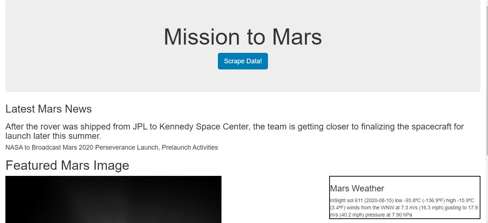

# Mars

In this assignment, I built a web application that scrapes various websites for data related to the Mission to Mars and displays the information in a single HTML page. The following outlines the work I completed

## How to Run Code

1. Clone the repository into a directory on your computer

2. Open the repository in a code source editor.

3. Navigate to flask_mars.py and run the code.

4. Wait until you see the web page running on a server and click the link to open the web page in your browser

5. Enjoy!

## Step 1 - Scraping

I Completed my initial scraping using Jupyter Notebook, BeautifulSoup, Pandas, and Requests/Splinter.

* I created a Jupyter Notebook file called `mission_to_mars.ipynb` and used this to complete all of my scraping and analysis tasks. 

### NASA Mars News

* Scraped the [NASA Mars News Site](https://mars.nasa.gov/news/) and collected the latest News Title and Paragraph Text. 

### JPL Mars Space Images - Featured Image

* Visited the url for JPL Featured Space Image [here](https://www.jpl.nasa.gov/spaceimages/?search=&category=Mars).

* Used splinter to navigate the site and find the image url for the current Featured Mars Image.

### Mars Weather

* Visited the Mars Weather twitter account [here](https://twitter.com/marswxreport?lang=en) and scraped the latest Mars weather tweet from the page.

### Mars Facts

* Visited the Mars Facts webpage [here](https://space-facts.com/mars/) and used Pandas to scrape the table containing facts about the planet including Diameter, Mass, etc.

* Used Pandas to convert the data to a HTML table string.

### Mars Hemispheres

* Visited the USGS Astrogeology site [here](https://astrogeology.usgs.gov/search/results?q=hemisphere+enhanced&k1=target&v1=Mars) to obtain high resolution images for each of Mar's hemispheres.

* Clicked each of the links to the hemispheres in order to find the image url to the full resolution image.

* Saved both the image url string for the full resolution hemisphere image, and the Hemisphere title containing the hemisphere name. Used a Python dictionary to store the data using the keys `img_url` and `title`.

* Appended the dictionary with the image url string and the hemisphere title to a list. This list contains one dictionary for each hemisphere.

## Step 2 - MongoDB and Flask Application

Used MongoDB with Flask templating to create a new HTML page that displays all of the information that was scraped from the URLs above.

* Converted my Jupyter notebook into a Python script called `scrape_mars.py` with a function called `scrape` that executes all of my scraping code from above and returns one Python dictionary containing all of the scraped data.

* Next, I create a routed called `/scrape` that imports my `scrape_mars.py` script and calls my `scrape` function.

  * Stored the return value in Mongo as a Python dictionary.

* Created a root route `/` that queries my Mongo database and passes the mars data into an HTML template to display the data.

* Created a template HTML file called `index.html` that takes the mars data dictionary and display all of the data in the appropriate HTML elements. 

## Screenshots

 

Above is a screenshot of the top half of the web application. When "Scrape Data!" is clicked on, the web page refreshes with the most recent data.

 

Above is a screenshot of the bottom half of the web application. Scraped information is displayed on the web page. A table was used to display facts about Mars so that the user can view all facts in a a clear, quick manner.

